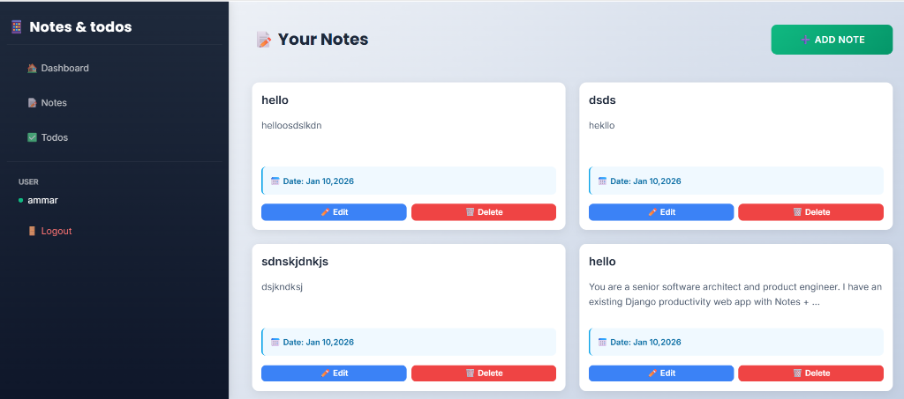
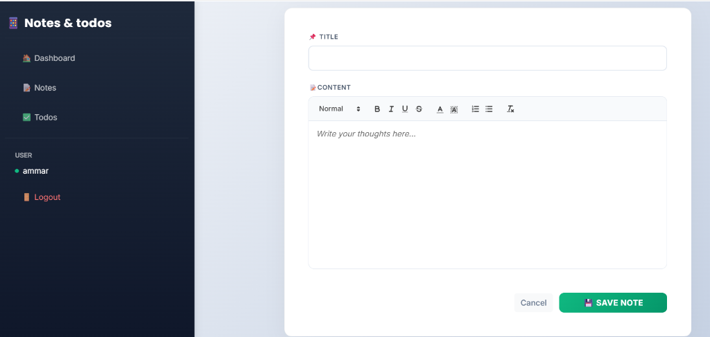

# 🚀 SmartApp - Personal Productivity Suite

A modern, secure, and featured-packed productivity application built with **Django**. Manage your tasks with a Kanban board, take rich-text notes, and stay organized with a premium dashboard.


## ✨ Key Features

### 📋 Interactive Kanban Board

- **Drag & Drop**: Effortlessly move tasks between "To Do", "In Progress", and "Done".
- **Real-time Updates**: Status changes are saved instantly via API.
- **Priority Management**: Visual indicators for high-priority tasks.

### 📝 Rich Text Notes

- **Quill.js Editor**: Write beautiful notes with bold, italics, lists, and colors.


### 🚀 Premium Dashboard

- **Glassmorphism Design**: Modern, frosted-glass UI aesthetic.
- **Priority Matrix**: Automatically categorizes tasks.
- **Add Todo**: Clean, modern task creation.

- **Priority Matrix (Eisenhower Box)**: Automatically categorizes tasks into "Urgent & Important" vs "Schedule".
- **Dynamic Greetings**: Welcomes you based on the time of day.
- **Focus Mode**: Highlights tasks due today.

### 🔐 Secure & Private
- **User Isolation**: Data is strictly scoped to the logged-in user.
- **Authentication**: Secure Login and Registration system.

## 🛠️ Tech Stack

- **Backend**: Django 5.x (Python)
- **Frontend**: Bootstrap 5, Custom CSS (Glassmorphism)
- **JavaScript Libraries**: 
  - `SortableJS` (Kanban Drag-and-Drop)
  - `Quill.js` (Rich Text Editor)
- **Database**: SQLite (Default) / Extensible to PostgreSQL

## ⚙️ Installation & Setup

1.  **Clone the repository**
    ```bash
    git clone https://github.com/yourusername/smartapp.git
    cd smartapp
    ```

2.  **Create a virtual environment**
    ```bash
    python -m venv venv
    # Windows
    venv\Scripts\activate
    # Mac/Linux
    source venv/bin/activate
    ```

3.  **Install Dependencies**
    ```bash
    pip install django
    # Or if requirements.txt exists:
    # pip install -r requirements.txt
    ```

4.  **Run Migrations**
    ```bash
    python manage.py migrate
    ```

5.  **Start the Server**
    ```bash
    python manage.py runserver
    ```

6.  **Visit the App**
    Open [http://127.0.0.1:8000/](http://127.0.0.1:8000/) in your browser.

## 🤝 Contributing

Contributions are welcome! Please fork the repository and create a pull request.

## 📄 License

This project is open-source and available under the MIT License.
